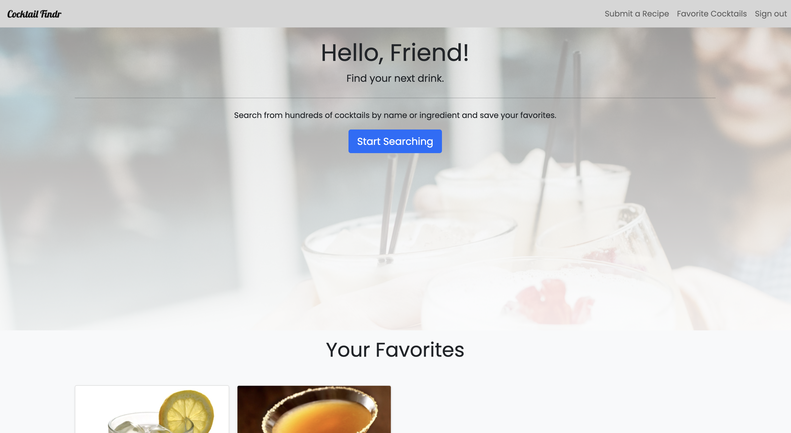
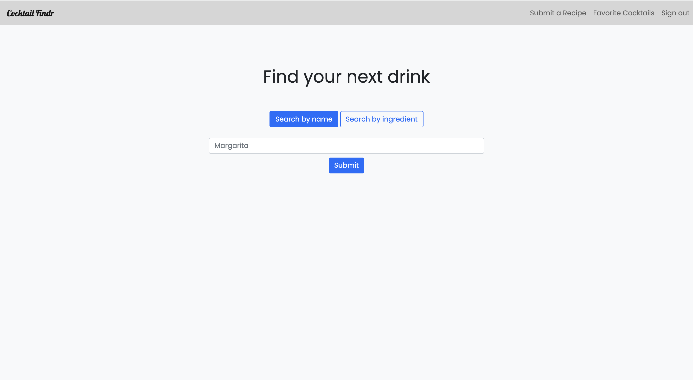
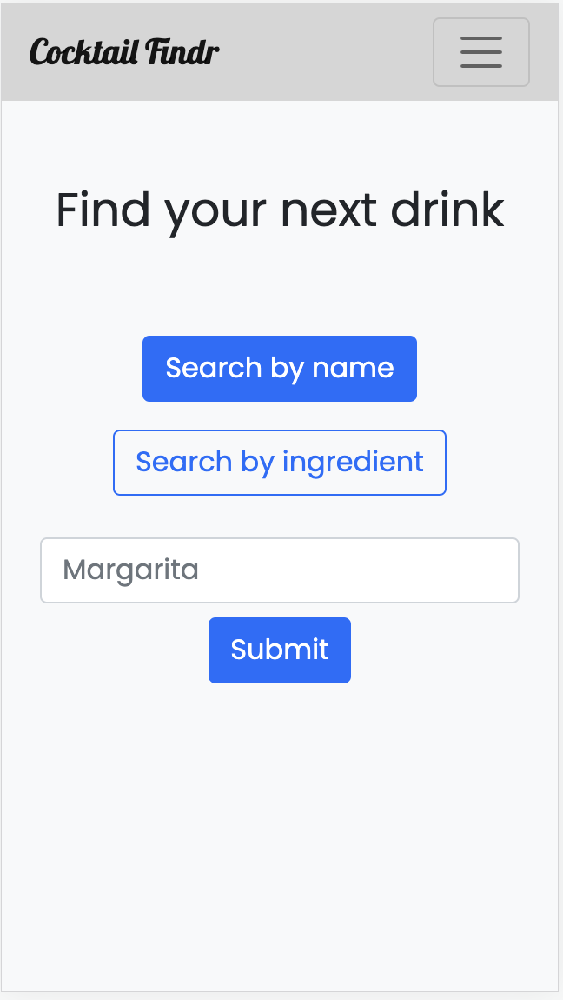
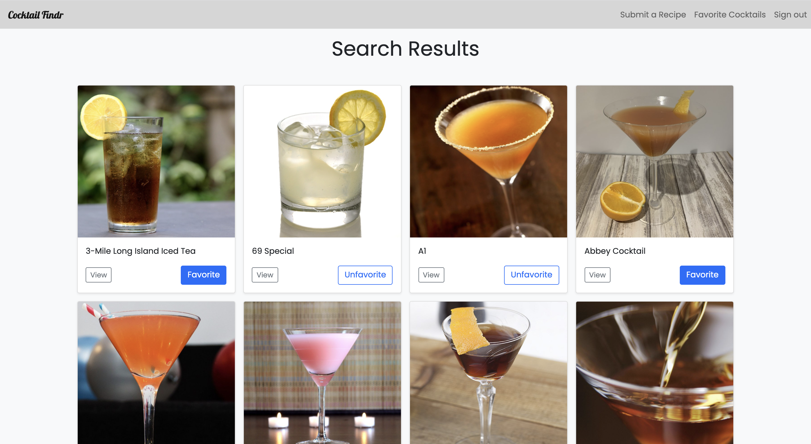
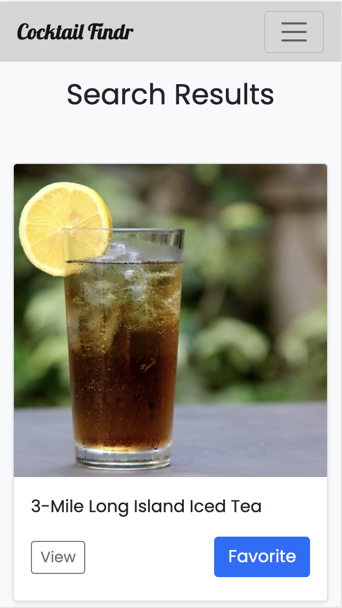
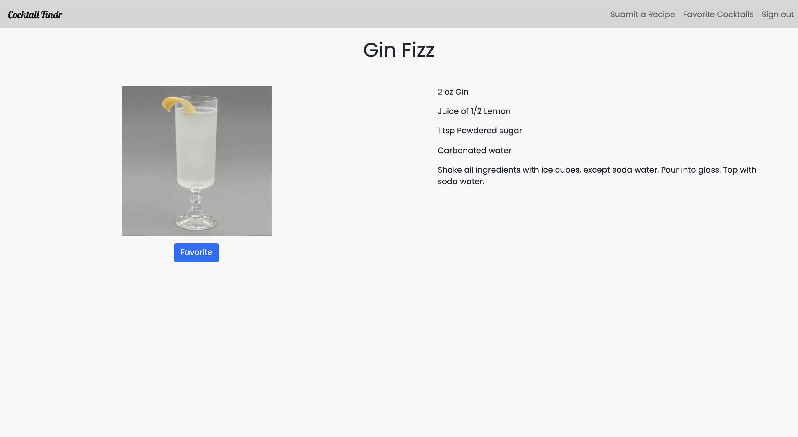
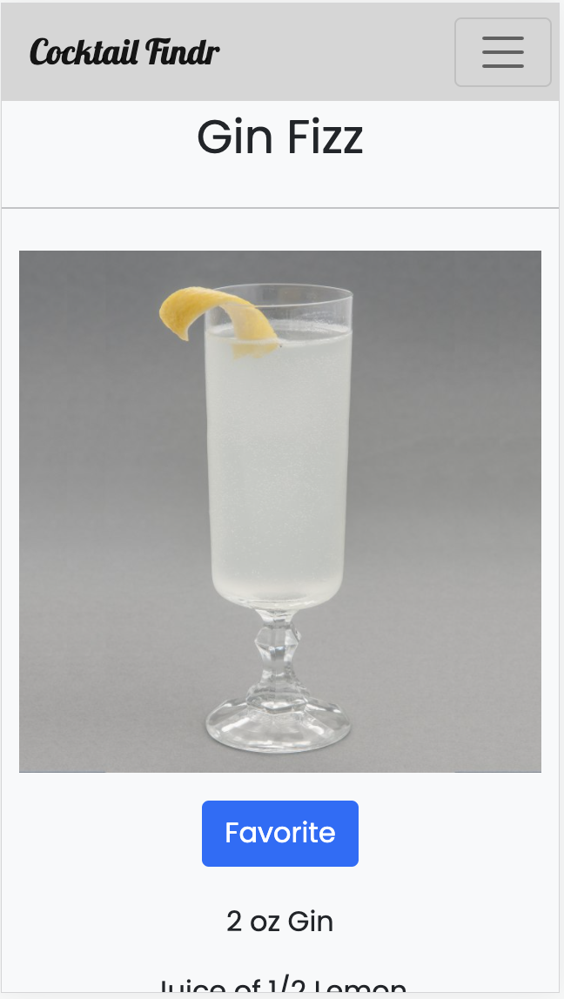
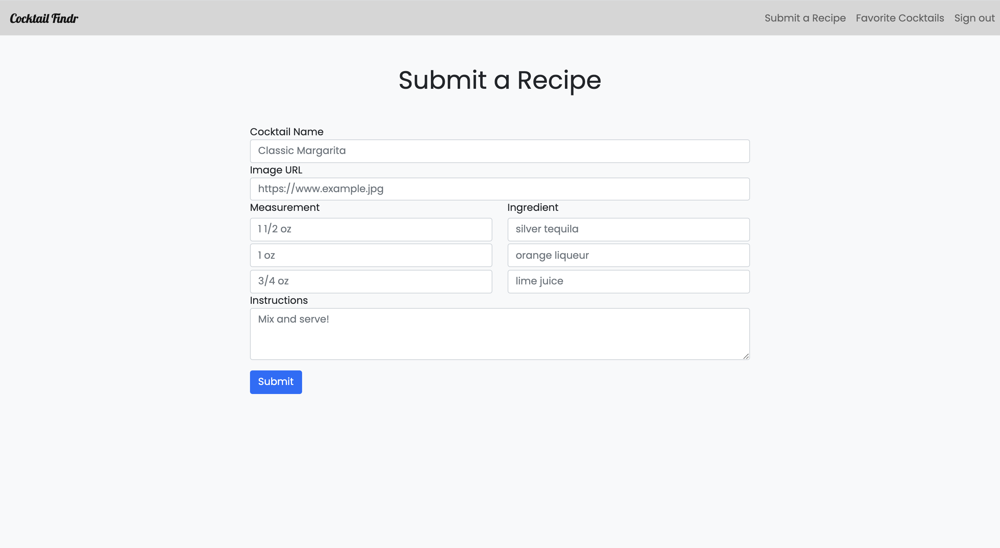
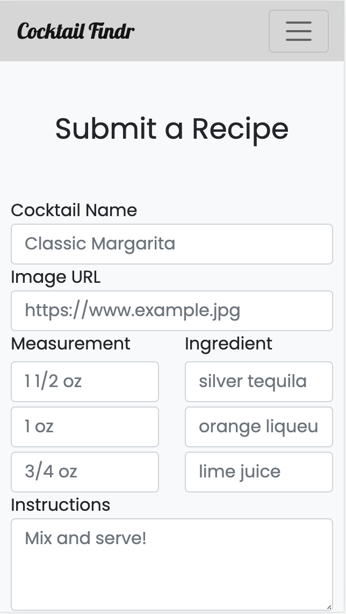

# COCKTAIL FINDR

COCKTIAL FINDR is an app for finding and favoriting cocktail recipes. Users can search for recipes by either name or ingredient. Once users create an account, they can save their favorite recipes for later, and even upload their own recipes to share with the community.

See the [deployed app](https://cocktailfindr.herokuapp.com/)

## Technologies Used:

- Ruby on Rails
- PostgreSQL
- Heroku
- HTML, CSS, Javascript (JQuery)
- Bootstrap
- Devise authentication

## Screenshots



<br>
<br>
<br>


<br>
<br>
<br>


<br>
<br>
<br>


<br>
<br>
<br>



## Getting started

To get started with the app, clone the repo and then install the needed gems:

```
$ gem install bundler -v 2.2.17
$ bundle _2.2.17_ config set --local without 'production'
$ bundle _2.2.17_ install
```

Next, migrate the database:

```
$ rails db:migrate
```

Run the app in a local server:

```
$ rails server
```

## Future Enhancements:

- Create additional ingredient inputs for user recipe submission
- Include flash message when no results found on search term
- Create cocktail ingredient table, and cocktail has many ingredients relationship
